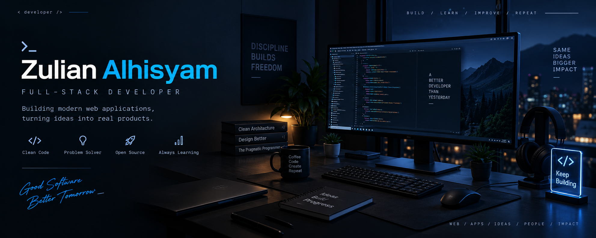

<div align="center">



<br/>

### Full-Stack Developer · Problem Solver · Builder

<p>
  <a href="https://github.com/zulian026">
    
  </a>
  <a href="mailto:zulianalhisyam@gmail.com">
    
  </a>
  <a href="https://www.linkedin.com/in/zulian-alhisyam-175414363/">
    
  </a>
</p>


</div>

---

## `> whoami`

I'm **Zulian Alhisyam**, a Full-Stack Developer who enjoys turning ideas into practical software.

My interests span from modern web applications and backend systems to Linux desktop tools and developer-focused projects.

I care about **clean architecture, good user experience, maintainable code, and continuous learning.**

```ts
const zulian = {
  role: "Full-Stack Developer",

  languages: [
    "TypeScript",
    "JavaScript",
    "PHP",
    "HTML",
    "CSS"
  ],

  frontend: [
    "React",
    "Next.js",
    "Vue",
    "Tailwind CSS"
  ],

  backend: [
    "Node.js",
    "Express",
    "Laravel",
    "CodeIgniter"
  ],

  databases: [
    "PostgreSQL",
    "MySQL",
    "MongoDB"
  ],

  tools: [
    "Git",
    "Docker",
    "Linux",
    "Figma",
    "Postman"
  ],

  mindset: "Build → Learn → Improve → Repeat"
};
```

---

## `> currently`

```text
┌─────────────────────────────────────────────────────────────┐
│                                                             │
│  🔨  Building       useful software & real-world projects   │
│  🌐  Developing     modern full-stack applications          │
│  🐧  Exploring      Linux & desktop development             │
│  🧠  Learning       system design & software architecture   │
│  🚀  Improving      code quality & developer experience     │
│                                                             │
└─────────────────────────────────────────────────────────────┘
```

---

## ⚡ Tech Stack

<div align="center">

### Frontend


<br/><br/>

### Backend


<br/><br/>

### Database


<br/><br/>

### Tools & Infrastructure


</div>

---

## 🚀 Featured Projects

<div align="center">

<a href="https://github.com/zulian026/voltify">

</a>

<a href="https://github.com/zulian026/zeroclicker">

</a>

</div>

<br/>

<table>
<tr>
<td width="50%" valign="top">

### ⚡ Voltify

A modern software project focused on building a clean and scalable application architecture.

**Focus**

* Modern frontend architecture
* Component-driven development
* Clean project structure
* Developer experience

</td>

<td width="50%" valign="top">

### 🖱️ ZeroClicker

A modern Linux auto-clicker application designed with a native desktop experience in mind.

**Focus**

* Linux desktop
* Native performance
* Modern UI
* Automation tooling

</td>
</tr>
</table>

---

## 📊 GitHub Statistics

<div align="center">


<br/><br/>


</div>

---

## 📈 Contribution Activity

<div align="center">


</div>

---

## 🐍 Contribution Snake

<div align="center">


</div>

---

## 🎯 2026 Goals

```text
[x] Build real-world applications
[x] Improve full-stack development skills
[x] Explore Linux development

[ ] Contribute to open source
[ ] Improve system design knowledge
[ ] Build more production-ready software
[ ] Ship projects consistently
[ ] Keep learning new technologies
```

---

## 🧠 Development Philosophy

<div align="center">

> **Build things that are useful.**
> **Keep the code simple.**
> **Learn from every problem.**

<br/>

`BUILD` → `BREAK` → `DEBUG` → `LEARN` → `IMPROVE` → `SHIP`

</div>

---

## 📫 Let's Connect

<div align="center">

I'm always interested in technology, open-source projects,
and building useful things.

<br/>

<a href="mailto:zulianalhisyam@gmail.com">

</a>

<a href="https://www.linkedin.com/in/zulian-alhisyam-175414363/">

</a>

</div>

---

<div align="center">


<br/><br/>

<sub>Built with curiosity, caffeine, and a questionable amount of debugging.</sub>

</div>
